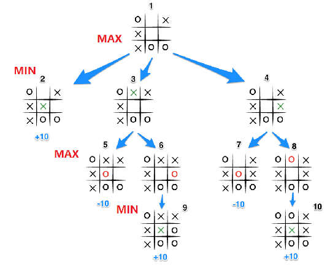
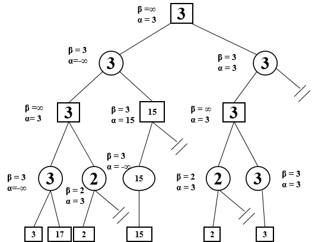
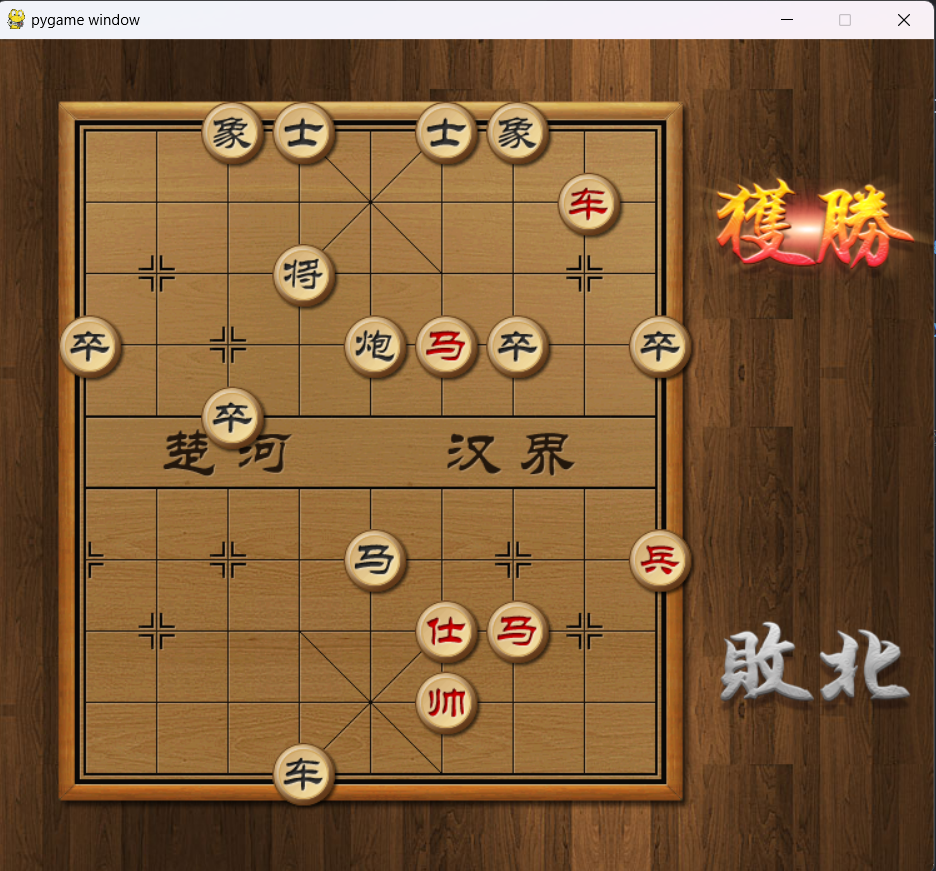
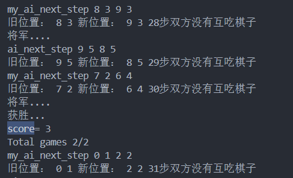
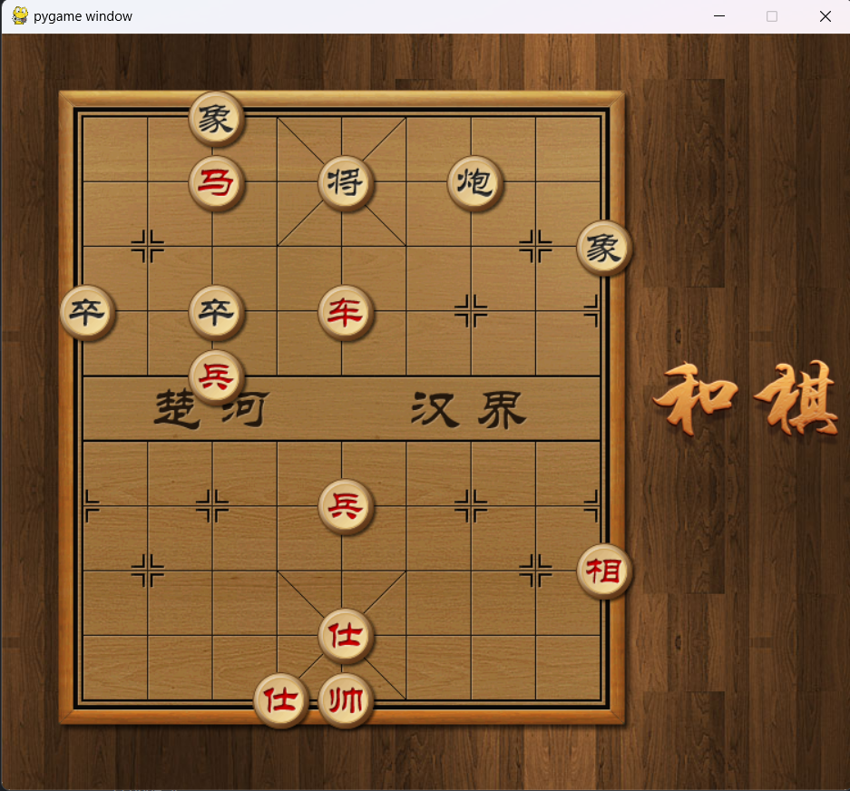
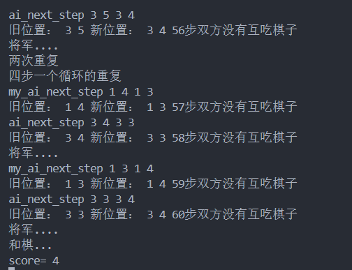

人工智能实验
中山大学计算机学院

人工智能
本科生实验报告

课程名称：Artificial Intelligence

| 学号 | 22336327 | 姓名 | 庄云皓 |
| ---- | -------- | ---- | ------ |

# 一、 **实验题目**

#### 利用博弈树搜索实现象棋AI

编写一个中国象棋博弈程序，要求用alpha-beta剪枝算法，可以实现两个AI对弈。
一方由人类点击或者AI算法控制。
一方由内置规则AI控制。
算法支持红黑双方互换

# 二、 **实验内容**

### 1. **算法原理**

#### **1.1Minimax搜索**

   假设：

   1.玩家A和玩家B的行动逐层交替；

   2.A和B的利益关系对立，即假设A要使分数更大，B就要使分数更小；

   3.A和B均采取最优策略。

   Minimax搜索：找到博弈树中内部节点的值，其中Max节点（A）的每一步扩展要使收益最大，Min节点（B）的扩展要使收益最小。
   简单地说，如果只向后看一步（也就是直接计算下一步的估价值）的话，那情况就是：先手预测了自己走完这一步的所有可能的局面，然后选择了所有走法中局面看起来最好的（估价函数的结果最好的）走法。

   下面是一个井字棋的例子

   

   在象棋的例子里面
   用一个列表[row,col,colnext_row, next_col]表示一步

   在maxdepth层根据评估函数算出棋盘的value。

   上一层如果是max层，对于每一个max节点，它的值就是与它相连（也就是能一步达到的）的所有棋盘状态的值的最大的值

   min层反之.
   最后在第一层找到节点最大的max

#### **1.2alpha-beta剪枝**

   Alpha-beta剪枝：剪掉不可能影响决策的分支，尽可能地消除部分搜索树。

   Max节点记录alpha值，Min节点记录beta值

   Max节点的alpha剪枝：效益值 ≥ 任何祖先Min节点的beta值

   Min节点的beta剪枝：效益值 ≤ 任何祖先Max节点的alpha值

   比如说一个max目前搜索到的与它相连的下一层的min节点的最大值为5，继续搜索到与他相连的一个min节点，然后这个min节点往下搜索到一个小于5的值，那么就不用继续往下搜了，因为min节点一定<5，那个max节点要找最大值一定不会找到它。

   如图所示：


   具体代码见下

### 2. **关键代码展示**

   My_AI类中的get_next函数,返回值为一个有四个元素的列表。self.old_pos表示选择一个要走的棋子的位置，self.new_pos是这个棋子要去的位置，也就是把棋子从self.old_pos移到self.new_pos

```python
       def get_next_step(self, chessboard: ChessBoard):
        cur_step = self.old_pos + self.new_pos
  
         # 使用alpha-beta剪枝的minimax递归
  
        score = self.minimax(chessboard, 1, -float('inf'), float('inf'))
        #对于即将失败的情况，在max_depth层已经找不到路，
        # 则在depth = 2进行搜索，才能找到“苟延残喘”的几步
        if cur_step == self.old_pos + self.new_pos:
            self.max_depth = 2
            self.minimax(chessboard, 1, -float('inf'), float('inf'))
            # print("lose")
        self.step.append(self.old_pos + self.new_pos)
        return self.old_pos + self.new_pos
```

   alpha-beta剪枝的minmax搜索

```python
       def minimax(self, chessboard:ChessBoard, depth, alpha, beta):
        if depth > self.max_depth or self.max_depth== 0 or chessboard.judge_win(self.team):
            #print("end")
            return self.evaluate_class.evaluate(chessboard)
        #获取当前所有棋子
        chesses = chessboard.get_chess()
        #print("chesses=",chesses)
        for chess in chesses:
            #max层
            if depth % 2 == 1 and chess.team == self.team:
               #获取所有可走的位置
                for new_x,new_y in chessboard.get_put_down_position(chess):
                    #原来下一步位置上的棋会在当前的棋下到这个位置后被覆盖，所以要保存一下：
                    ori_cs = chessboard.chessboard_map[new_x][new_y]
                    old_x,old_y = chess.row,chess.col
                    #移到当前棋子到下一步的位置
                    #my_move函数中移动棋盘上的棋子（也就是跟新了chessboard.chess_map）同时更新了棋子的rosw和col属性
                    chessboard.my_move(chess, new_x, new_y)
                    score = self.minimax(chessboard, depth + 1, alpha, beta)#跟新depth,走到下一层
                    #复原棋盘
                    chessboard.my_move(chess,old_x,old_y)
                    chessboard.chessboard_map[new_x][new_y]=ori_cs

                    # # 对将军情况进行单独加分
                    if chessboard.judge_attack_general(self.team):
                        score += 5000  # 将军
                     #防止重复走
                    if len(self.step)>1:
                        if depth == 1 and [old_x,old_y,new_x, new_y] == self.step[-2]:
                            #print("有重复")
                            score -= 200
                        if depth == 1 and len(self.step)>3 and [old_x,old_y,new_x, new_y] == self.step[-2] and [old_x,old_y,new_x, new_y] == self.step[-4]:
                            print("两次重复")
                            score -= 80000
                        if len(self.step)> 3  and depth == 1 and [old_x,old_y,new_x, new_y] == self.step[-4]:
                            print("四步一个循环的重复")
                            score -= 1000
                        if len(self.step)> 7  and depth == 1 and [old_x,old_y,new_x, new_y] == self.step[-4] and [old_x,old_y,new_x, new_y] == self.step[-8]:
                            score -= 80000
    

                    #在score大于alpha时进行更新step
                    if(score> alpha ) and depth==1:
                            print("alpha,score",alpha,score)
                            self.old_pos=[chess.row,chess.col]
                            self.new_pos=[new_x,new_y]
                            #print("old_pos,new_pos",self.old_pos,self.new_pos)

                    alpha = max(alpha, score)
    
                    if beta <= alpha:
                        return alpha
                #return score
            else:
                 if depth % 2 == 0 and chess.team != self.team:
                    #min_score = float('inf')
                    for new_x,new_y in chessboard.get_put_down_position(chess):
                        #原来下一步上的棋：
                        ori_cs = chessboard.chessboard_map[new_x][new_y]
                        old_x,old_y = chess.row,chess.col
                        chessboard.my_move(chess, new_x, new_y)
                        chess.update_position(new_x, new_y)
                        score = self.minimax(chessboard, depth + 1, alpha, beta)#跟新depth,走到下一层
                        #print("score= ",score)
                        #复原
                        chessboard.my_move(chess,old_x,old_y)
                        chessboard.chessboard_map[new_x][new_y]=ori_cs
                        #print("back")
                        #min_score = min(min_score, score)
                        beta = min(beta, score)
                        if beta <= alpha:
                            return beta
                    #return score
        if depth%2==1:
            return alpha
        else:
            return beta
```

实现了先后手互换功能：详见Game.py中的reset_game函数

### 3. **创新点&优化**

3.1 判断了我方重复走棋的情况，判断了这两种。对方的ai没有进行判断，会重复循环走子。


```python
                #防止重复走
		if len(self.step)>1:
                        if depth == 1 and [old_x,old_y,new_x, new_y] == self.step[-2]:
                            #print("有重复")
                            score -= 200
                        if depth == 1 and len(self.step)>3 and [old_x,old_y,new_x, new_y] == self.step[-2] and [old_x,old_y,new_x, new_y] == self.step[-4]:
                            print("两次重复")
                            score -= 80000
                        if len(self.step)> 3  and depth == 1 and [old_x,old_y,new_x, new_y] == self.step[-4]:
                            print("四步一个循环的重复")
                            score -= 1000
                        if len(self.step)> 7  and depth == 1 and [old_x,old_y,new_x, new_y] == self.step[-4] and [old_x,old_y,new_x, new_y] == self.step[-8]:
                            score -= 80000
```

3.2 可以根据可以搜索到的step的数量动态决定搜索的深度（目前还没实现）

3.3 在人机对战时增加了认输功能（点击认输按钮重置棋盘）。增加了失败方的显示（显示败北）

# 三、 **实验结果及分析**

### **1. 实验结果展示示例**

自动切换先后手,my_ai均为黑棋

赢_我方黑棋先手





和棋_我方黑棋后手





也可以在main.py手动指定我方是红棋还是黑棋

### **2. 评测指标展示及分析**

时间复杂度分析：Minimax算法对游戏树执行完整的深度优先探索Depth First，若树的最大深度为m，每个点有b个合法有效的动作方法，则算法的**时间复杂度**为 $O({b}^m)$

在这个象棋游戏中，我们指定了搜索的最大层数为m（也就是代码中的max_depth）,没有遍历所有层。也就是启发式地计算（非终止节点）叶子节点的值。

在应用Alpha-Beta剪枝后，搜索树的节点数量可以大幅减少。具体剪枝的效果取决于游戏树的结构和Alpha-Beta算法的实现。在最好的情况下，Alpha-Beta剪枝可以将搜索树的节点数量减少到线性级别，即 $O(b*m)$。但在最坏的情况下，即搜索树的结构无法有效剪枝时，时间复杂度仍然是指数级的。

在max_depth为4时，下一盘棋大概要10分钟

# 四、 **参考资料**

ch3搜索技术IV.ppt
