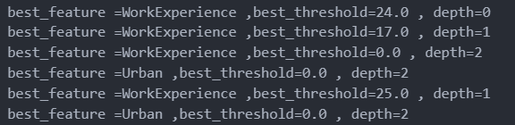
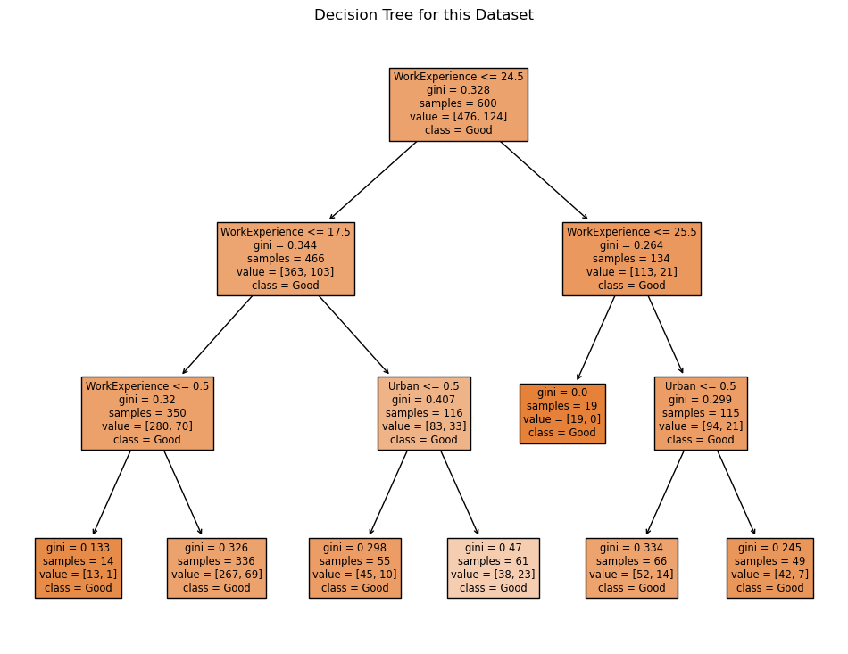
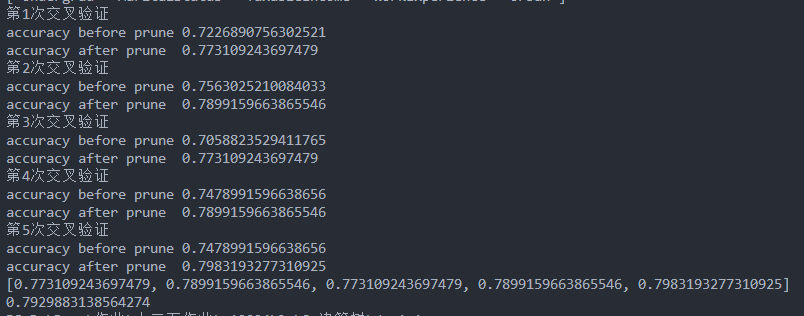

# **中山大学计算机学院  人工智能 本科生实验报告**

课程名称：Artificial Intelligence

|   学号   | 姓名   |
| :------: | ------ |
| 22336327 | 庄云皓 |

# 一、 **实验题目**

### 信誉度分类任务

`DT_data.csv`数据集包含三列共600条数据，其中每条数据有如下属性：

* Undergrad : person is under graduated or not
* MaritalStatus : marital status of a person
* TaxableIncome : Taxable income is the amount of how much tax an individual owes to the government
* WorkExperience : Work experience of an individual person
* Urban : Whether that person belongs to urban area or not

将那些 `TaxableIncome <= 30000` 的人视为”有风险”，而其他人则为“好”。利用决策树算法实现对个人信誉度的分类。

使用 `numpy`库、`matplotlib`库以及python标准库。

# 二、 **实验内容**

1. **算法原理**

   采用CART算法进行决策树生成和剪枝**

   **基尼系数：**

   基尼指数（Gini不纯度）表示在样本集合中一个随机选中的样本被分错的概率。

   分类问题中，假设有K个类别，样本点属于第k类别的概率为$p_{k}$

   则基尼系数为：

   $Gini(p)=\sum_{i=1}^{n}p_{k}\times(1-p_{k})=1-\sum_{i=1}^{n}p_{k}^2$

   注意：Gini指数越小表示集合中被选中的样本被参错的概率越小，也就是说集合的纯度越高，反之，集合越不纯。当集合中所有样本为一个类时，基尼指数为0.

   特别的，对于样本D，如果根据特征A的某个值a，把$\mathcal{D} \text{分 成 D}_1$和$\mathcal{D}_2$两部分，则在特征A的条件下，D的基尼指数表达式为：

   $$
   \mathrm{Gini(D,A)}=\frac{|\mathrm{D}_1|}{|\mathrm{D}|}\mathrm{Gini(D_1)}+\frac{|\mathrm{D}_2|}{|\mathrm{D}|}\mathrm{Gini(D_2)}
   $$

   **决策树生成**

   > 输入：训练数据集，停止计算的条件
   > 输出：CART决策树即分类树
   > 根据训练数据集，从根结点开始，递归地对每个结点进行以下操作，构建二叉决策树
   > （1）训练数据集为D,计算现有特征对训练数据集的基尼指数，此时对于每一个特征A,对其可能取得每一个值a，根据此值将训练样本切分为D1和D2两部分，然后根据上式计算A=a基尼指数。
   > （2）在所有可能的特征A以及所有可能的切分点a中，选择基尼指数最小的特征及其对应的切分点作为最优的特征及切分点，从结点生成两个子结点，将训练数据集分配到子结点中去。
   > （3）递归的调用（1 ），（2）， 直到满足停止的条件
   > （4）生成分类决策树
   >

   我们来看一个具体的例子

   

   **决策树剪枝**

   剪枝的作用:通过剪枝来提高泛化性，缓解过拟合预剪枝:同时使用决策树的验证集，通过决策树结点划分是否能提高验证集精度来确认是否划分，若划分不能提高验证集精度，则将其划为叶结点。

   + 预剪枝：提前终止某些分支的生长。
   + 后剪枝：在决策树已经建立的基础上，把某些分割的点用叶子节点来替代。
     具体来看后剪枝过程：首先从生成算法产生的决策树底端开始不断的剪枝，直到T0的根结点，形成子树序列{T0,T1,T2,T..Tn„}T0就是没剪的，T1就是剪了一个叶结点的，T2就是又剪了一点的
     然后通过交叉验证法在独立的验证数据集上对子树序列进行测试，从中选择最优子树，具体操作见下。
2. **关键代码展示**

   数据预处理部分：

   ```python
   def read_csv(filename):
       arr = np.loadtxt(filename,
                    delimiter=",", skiprows=0, dtype=str)
       features = arr[0]
       arr = arr[1:-1]
       return arr,features
   data,features = read_csv("DT_data.csv")
   print(features)

   label_num = 2
   X = np.delete(data,obj=label_num,axis=1)
   y = np.where(data[:, label_num].astype(int) <= 30000, 1, 0)  # 信誉度分类
   features = np.delete(features,label_num)

   #转化为数值数组
   X_encoded = np.zeros(X.shape)
   for i in range(X.shape[1]):
       if i != 2:  #年龄这一列不需要进行变化
           unique_labels = np.unique(X[:, i])#去重
           label_mapping = {label: j for j, label in enumerate(unique_labels)}#获取字符串和数字组成的键值对
           X_encoded[:, i] = np.array([label_mapping[label] for label in X[:, i]])

       else:
           X_encoded[:,i] = X[:,i]
   ```

   X是删除label列之后的数据，y是label列转化为01值，X_encoded是转化之后的字符数组

   节点类：

   ```python
   class Node:
       def __init__(self, feature=None, threshold=None, value=None,num=0):
           self.feature = feature  # 特征索引
           self.threshold = threshold # 分割阈值
           self.left = None
           self.right = None
           self.value = value # 叶子节点的类别
           self.num = num # 叶子节点的样本数量
   ```

   决策树类：

   ```python
   class DecisionTree:
      def __init__(self, min_samples_split=2, max_depth=10):
         self.min_samples_split = min_samples_split
         self.max_depth = max_depth
         self.root = None
      def gini_index(self,labels):
         #np.unique函数
         _,counts = np.unique(labels,return_counts=True)
         probs = counts / len(labels)
         gini = 1-np.sum(probs ** 2)
         return gini
      def split_dataset(self,X,y,feature,threshold):
         #获取是否小于threshold的掩码
         left_mask = X[:,feature] <= threshold
         right_mask = X[:,feature] > threshold
         #print('y[right_mask]',y[right_mask])
         return X[left_mask],y[left_mask], X[right_mask], y[right_mask]
      def get_best_split(self,X,y):
         best_feature,best_threshold, gini =None, None, np.inf
         y_left = y_right = None
         #下面进行遍历，以基尼系数最小为标准，获取最佳分裂点
         for i in range(X.shape[1]):
               thresholds = np.unique(X[:,i])
               #print(thresholds)
               for threshold in thresholds:
                  X_left,y_left,X_right,y_right = self.split_dataset(X,y,i,threshold)
                  tmp_gini = (len(y_left)*self.gini_index(y_left) + len(y_right)*self.gini_index(y_right))/len(y)
                  if tmp_gini < gini:
                     gini = tmp_gini
                     best_threshold = threshold
                     best_feature = i
         #print("best_feature ={} ,best_threshold={} ".format(best_feature,best_threshold))
         X_left,y_left,X_right,y_right = self.split_dataset(X,y,best_feature,best_threshold)
         #print("y_left and right:",y_left,y_right)
         if len(y_left)==0 or len(y_right)==0:
               # print("best_feature ={} ,best_threshold={} ".format(best_feature,best_threshold))
               # print(best_feature,best_threshold)
               # X_left,y_left,X_right,y_right = self.split_dataset(X,y,best_feature,best_threshold)
               # print('y_left',y_left,'y_right',y_right)
               return None,None,1
         return best_feature,best_threshold,gini
      def build_tree(self,X,y,depth=0):
         #y中出现最多的数字
         label = np.argmax(np.bincount(y))

         if len(np.unique(y))==1:
         #所有子节点均为同一类
               #print(y[0])
               return Node(value=y[0], num=len(y))
         if depth>self.max_depth:
               return Node(value=label, num=len(y))
         best_feature,best_threshold,gini = self.get_best_split(X,y)
         if best_feature==None:
               return Node(value=label, num=len(y))
         #print("best_feature ={} ,best_threshold={} , depth={} ".format(features[best_feature],best_threshold,depth))

         node = Node(feature=best_feature,threshold=best_threshold,num= len(y),value=label)
         #切分数据
         X_left,y_left,X_right,y_right = self.split_dataset(X,y,best_feature,best_threshold)
         #递归
         node.left = self.build_tree(X_left,y_left,depth+1)
         node.right = self.build_tree(X_right,y_right,depth+1)
         return node
      #再封装一层
      def fit(self,X,y):
         self.root = self.build_tree(X,y)
      #剪枝
      def prune_tree(self,node,X,y):

         if node.left == None and node.right == None:
               return
         if node.left != None:
            self.prune_tree(node.left,X,y)
         if node.right != None:
            self.prune_tree(node.right,X,y)# 这里没有return

         acc_before = self.cal_acc(X,y)
         temp_left = node.left
         temp_right = node.right
         if(temp_left.num>temp_right.num):
                  node.value = temp_left.value
         else:
                  node.value = temp_right.value

         node.left = None
         node.right = None   
         #print(temp_left==None)
         acc_after = self.cal_acc(X,y)

         if (acc_after<acc_before):
               node.left = temp_left
               node.right = temp_right

         # else:


      #预测新样本label
      def predict(self,X):

         y = np.zeros(X.shape[0])
         for index,sample in enumerate(X):
               node = self.root
               while node.left !=None and node.right != None:
                  feature = node.feature
                  #print("node.threshold ",node.threshold)
                  #print(sample[feature])
                  if sample[feature] < node.threshold:
                     node = node.left
                  else:
                     node = node.right
               assert node.value!=None
               y[index] = node.value
         return y
      #计算准确率
      def cal_acc(self,X,y):
         cnt = 0
         pred = self.predict(X)
         #print(y)
         acc = np.sum(pred==y)/len(y)
         return acc
   ```

   训练过程：

   采用k=5格交叉验证，训练集，验证集，测试集划分为5.6：1.4：3，其中训练集用来建树，验证集用来剪枝，测试集检测模型准确率

   ```python
   # 设置随机数种子,确保每次划分结果一致
   np.random.seed(42)
   # 计算测试集的样本数
   test_size = int(X.shape[0] * 0.3)
   K = 5 #5格交叉验证
   fold_size = X.shape[0] // K
   acc_list = []
   # 重复 5 次划分过程
   for i in range(K):
      val_start = i*fold_size
      val_end = (i+1)*fold_size
      np.random.seed(i)

      indices = np.random.permutation(data.shape[0])
      # 按 70:30 的比例划分训练集和测试集
      # 计算测试集的样本数
      test_size = int(data.shape[0] * 0.2)
      train_indices = np.concatenate((indices[:val_start], indices[val_end:])) #数组拼接

      test_indices = indices[:test_size]
      train_indices = indices[test_size:]

      X_train = X_encoded[train_indices, :]
      y_train = y[train_indices]
      X_val = X_encoded[val_start:val_end,:]
      y_val = y[val_start:val_end]
      X_test = X_encoded[test_indices, :]
      y_test = y[test_indices]

      print('第{}次交叉验证'.format(i+1))
      tree = DecisionTree(max_depth=10)
      tree.fit(X_train,y_train)
      print('accuracy before prune',tree.cal_acc(X_test,y_test))
      tree.prune_tree(tree.root,X_val,y_val)
      print('accuracy after prune ',tree.cal_acc(X_test,y_test))
      acc = tree.cal_acc(X_test,y_test)
      acc_list.append(acc)
   print(acc_list)
   ```

3.**创新点&优化**

后剪枝:如果剪掉叶子节点后在验证集上准确率提升则减去该节点叶子节点

随机森林：利用训练数据随机产生多个决策树，形成一个森林。然后使用这个森林对数据进行预测，选取最多结果作为预测结果。可以减少过拟合

这与交叉验证产生了多个决策树类似，最后用平均准确率作为衡量标准。因为没有新样本的预测任务，我就没有用随机森林进行“投票”预测。

# 三、 **实验结果及分析**

**1. 实验结果展示示例**

设置最大深度=3时的树结构：



为了检验结果是否正确，将自己写的决策树与sklearn中的决策树进行对照，结果见下，发现结果大致是相同的。区别在于我采用的分界点threshold都是在数据中出现过的值，

而sklearn中的决策树采用的是两个数据的中间值作为分界点。比如一个对特征而言，所有样本的值经过排序分别为x1,x2···xn,我采用原始数据中的某个值作为分界的阈值，而sklearn中的决策树采用(x1+x2)/2,(x2+x3)/2这样，这解释了为什么threshold会出现0.5的偏差。



**2. 评测指标展示及分析**

最大深度为10经过剪枝的决策树结果，可以看出与没有剪枝相比有准确率的提升



# 四、 **参考资料**

[Python手撸机器学习系列（六）：决策树（附Python实现西瓜书决策树构建及剪枝代码） - 知乎 (zhihu.com)](https://zhuanlan.zhihu.com/p/499238588)

[Assignment 14 Fraud Check - Decision Trees.ipynb (github.com)](https://gist.github.com/perlineanisha/ba6ca655028a269ea99636497f1d0b23)

[机器学习笔记21——决策树之CART算法原理及python实现案例_cart算法案例-CSDN博客](https://blog.csdn.net/weixin_45666566/article/details/107954454)
